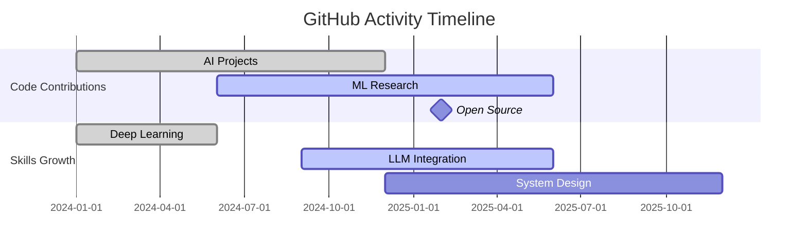
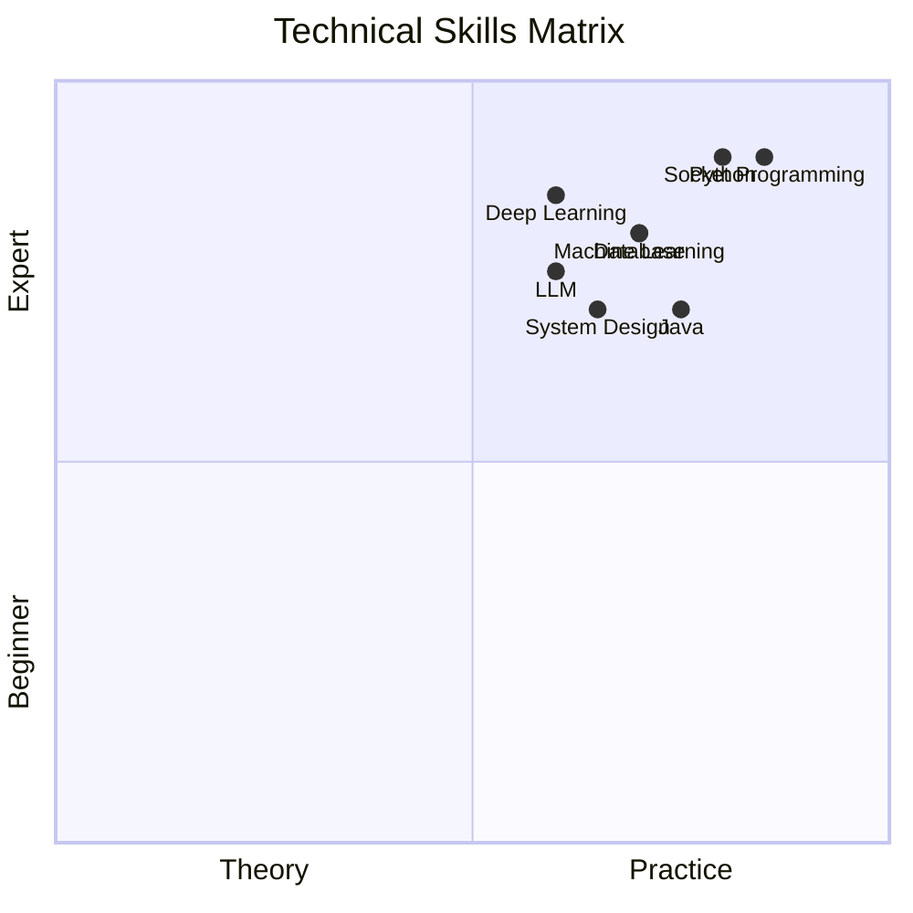
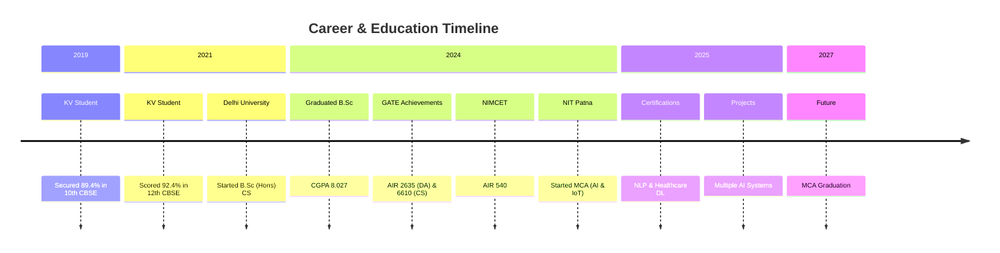

# 🌟 Prashant Mishra | AI & IoT Developer

<!-- Animated Header -->

<!-- Animated Stats -->

<!-- GitHub Stats with Animation -->
<table>
<tr>
<td width="50%">

## 📈 GitHub Analytics

</td>
<td width="50%">

## 🚀 Live Stats

  

</td>
</tr>
</table>

<!-- Animated Skills Radar -->

## 🎯 Skills Radar

<!-- Interactive Project Cards -->

## 🏆 Featured Projects

<table>
<tr>
<td>

### 🤖 AI Healthcare System

  

  
**Tech Stack:**

</td>
<td>

### 🎮 AI Game Agent

  

  
**Tech Stack:**

</td>
</tr>
<tr>
<td>

### 💬 LLM Chat System

  

  
**Tech Stack:**

</td>
<td>

### 🌪️ Disaster Management

  

  
**Tech Stack:**

</td>
</tr>
</table>

<!-- Animated Timeline -->

## 📅 Journey Timeline

<!-- Interactive Skill Badges with Animation -->

## 🔧 Tech Stack

### Programming Languages

<!-- Python with animation -->

  
  ★

### AI/ML Specialization

  
  

### Databases & Systems

  
  

<!-- Achievement Cards with Hover Effects -->

## 🏅 Achievements & Certifications

<table>
<tr>
<td align="center" width="25%">

### 🥇 NIMCET 2024
**AIR 540**  
National Level

</td>
<td align="center" width="25%">

### 🥈 GATE DA 2024
**AIR 2635**  
Data Science & AI

</td>
<td align="center" width="25%">

### 🥉 GATE CS 2024
**AIR 6610**  
Computer Science

</td>
<td align="center" width="25%">

### 🎓 MCA AI & IoT
**CGPA: 9.5/10**  
NIT Patna

</td>
</tr>
</table>

<h4>🎓 NLP with Deep Learning</h4>

E-ICT Academy, NIT Patna/Jamshedpur

Jun-Jul 2025

<h4>🏥 Smart Healthcare with DL</h4>

E-ICT Academy, NIT Patna

June 2025

<!-- Contact Section with Animation -->

## 📞 Let's Connect!

<!-- LinkedIn Button with Animation -->
<a href="https://linkedin.com/in/prashant-mishra-nitp" style="text-decoration: none;">
  

    💼
    LinkedIn
  

</a>

<!-- Email Button with Animation -->
<a href="mailto:prashantm.mca24@nitp.ac.in" style="text-decoration: none;">
  

    ✉️
    Email
  

</a>

<!-- GitHub Button with Animation -->
<a href="https://github.com/prashant-mishra-22" style="text-decoration: none;">
  

    🐙
    GitHub
  

</a>

<!-- Resume Button with Animation -->
<a href="#" style="text-decoration: none;">
  

    📄
    Resume
  

</a>

<!-- Live Status -->

● 
<strong>Current Status:</strong> Actively building AI projects | Open to collaborations

📍 NIT Patna, Bihar | 📅 MCA Graduation: 2027

<!-- Animated Footer -->

"Just a chill guy who can talk about computers" 👨‍💻

⚡ Powered by: 
GitHub | Mermaid | Shields.io

<!-- Visitor Counter -->

<!-- CSS for Animations -->

<h3>🌟 Star my repositories if you like my work!</h3>

Your support motivates me to build more amazing projects! 🚀

